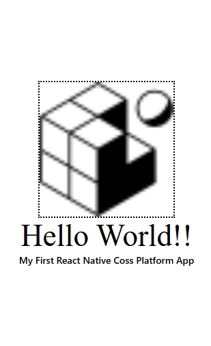

# Day 1 ( 2024/12/17 )

This is a simple **React Native Cross-Platform Application** that displays an image and text components styled with React Native's `StyleSheet`.

---

## Features

1. **Image Display**  
   - Displays a React logo image with a dotted border.  

2. **Custom Text Styling**  
   - Includes a headline with custom font and size.  
   - Includes a subheadline with different font weights.  

3. **Centered Layout**  
   - The image and text are centrally aligned for a clean interface.  

---

## Component Breakdown

### `Index.js`  
- The main component of the app.  
- Displays:  
  - A centrally aligned **React logo**.  
  - A **headline** ("Hello World!!").  
  - A **subheadline** ("My First React Native Cross-Platform App").  

---

## Workflow

1. **App Launch**  
   - The `Index` component is rendered, displaying the React logo and text elements.  

2. **Image and Text Styling**  
   - The logo image has a width and height of 200 with a dotted border.  
   - The headline uses "Times New Roman" font with a size of 45.  
   - The subheadline text uses medium font weight (`500`).  

3. **Centered Layout**  
   - The `View` container uses Flexbox to center all elements on the screen.  

---

## Styling

- The app uses React Native's `StyleSheet` for defining styles.  
- Styles include:  
  - Image dimensions and border.  
  - Custom font family, size, and weight for text elements.  
  - Flexbox layout for central alignment.  

---

### Output
  
