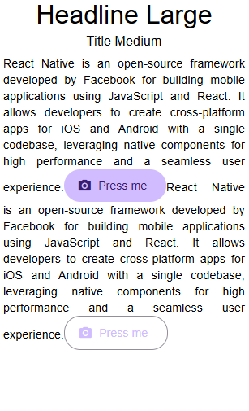

# React Native App with Enhanced UI

This React Native project demonstrates the integration of **React Native Paper**, **Safe Area Context**, and **ScrollView** to create a responsive and modern user interface. It includes a `Home` component displaying styled text, buttons, and dividers.

---

## Features

1. **UI Framework Integration**  
   - Uses **React Native Paper** for material design components like buttons and dividers.  

2. **Safe Area and Scrolling**  
   - Implements **Safe Area Context** to ensure the app content respects the device's safe areas.  
   - Utilizes **ScrollView** to enable vertical scrolling for overflow content.  

3. **Text and Button Styling**  
   - Displays headlines and body text with **React Native Paper** typography styles.  
   - Adds clickable buttons with **contained** and **outlined** styles.  

4. **Status Bar Integration**  
   - Dynamically handles the status bar appearance with **expo-status-bar**.  

---

## Folder Structure

```
src/
├── components/
│   ├── 2024-12-21/
│   │   ├── Home.js
├── App.js
└── index.js
```

---

## Component Breakdown

### `Index.js`  
- The root component that sets up the application layout.  
- Includes:  
  - **SafeAreaView** to account for device-safe areas.  
  - **ScrollView** to handle vertical scrolling for nested components.  
  - Integrates **React Native Paper** as the app's UI framework.  
  - Renders the `Home` component inside a centrally aligned container.

### `Home.js`  
- Displays styled text, dividers, and buttons:  
  - **Typography**: Headlines and body text styled with `variant` properties.  
  - **Buttons**: Interactive material design buttons with icons.  
  - **Dividers**: Visual separators for content sections.  

---

## Workflow

1. **App Initialization**  
   - The `Index` component initializes with `PaperProvider` and `SafeAreaView`.  

2. **Content Rendering**  
   - The `Home` component displays styled text, buttons, and dividers inside a scrollable view.  

3. **Interactive Buttons**  
   - Buttons log messages to the console upon being pressed.  

4. **Dynamic Styling**  
   - Typography and layout are handled via `StyleSheet` and `React Native Paper` styles.  

---

## Styling

- **Container**  
  - Aligns and centers content with `flexbox`.  
  - Provides a white background for a clean appearance.  

- **Typography**  
  - Text elements styled with `variant` properties like `headlineLarge` and `bodyMedium`.  

- **Buttons**  
  - Two styles implemented:  
    - **Contained**: Solid background.  
    - **Outlined**: Border-only style.  

---

## How to Import New Libraries

### **React Native Paper**
- **Install**:  
  ```bash
  npm install react-native-paper react-native-vector-icons
  ```
- **Usage**: Wrap your app with `PaperProvider`:  
  ```jsx
  import { PaperProvider } from 'react-native-paper';
  ```
- Use material design components such as `Button`, `Text`, and `Divider`.

---

### **Safe Area Context**
- **Install**:  
  ```bash
  npm install react-native-safe-area-context
  ```
- **Usage**: Wrap components with `SafeAreaView` to respect safe areas:  
  ```jsx
  import { SafeAreaView } from 'react-native-safe-area-context';
  ```

---

### **ScrollView**
- **Install**: Built-in with React Native.
- **Usage**: Use `ScrollView` to enable vertical scrolling:  
  ```jsx
  import { ScrollView } from 'react-native';
  ```  
  Wrap overflow content with `<ScrollView>` to make it scrollable.

---

## Output

  